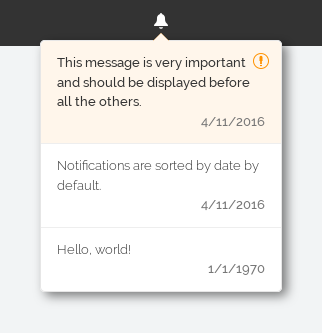

# Ember Notification Center [](https://travis-ci.org/eliksir/ember-notification-center) [](https://emberobserver.com/addons/ember-notification-center)

Ember Notification Center is an [Ember](http://emberjs.com/) addon for managing
and displaying notification messages.

## Installation

### As an addon

* `ember install ember-notification-center`

### For development

* `git clone` this repository
* `npm install`
* `bower install`

## Usage

This addon provides an Ember Data notification model and a component for
rendering such models.

The component can be used as follows, assuming that `notifications` is bound to
an array of `notification` model instances:

```hbs
{{#notification-list notifications=notifications}}
  Click me to view your notifications!
{{/notification-list}}
```

This will render a button that displays a list of notifications when
clicked. A message and creation date is displayed for each message.

Notifications with the `important` property set to `true` receive the
class `important`, while unseen notifications receive the additional
class `new`.

The notifications are ordered by date, but important notifications are
listed before ordinary ones. The maximum number of notifications to
show is determined by the property `numNotifications`, which is 3 by
default.

Below is an example of how the notification list can look when styled.



## Running Tests

* `npm test` (Runs `ember try:testall` to test the addon against multiple Ember versions)
* `ember test`
* `ember test --server`

## Building

* `ember build`

For more information on using ember-cli, visit [http://www.ember-cli.com/](http://www.ember-cli.com/).
